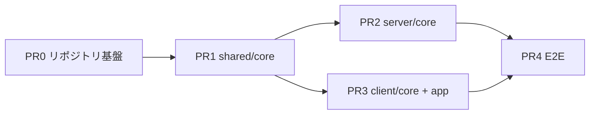

# 実装計画: M0（骨組み）

## 結論

M0を5つのPRに分け、依存順に実装する。

各PRは「読む文書・作るもの・受入条件・禁止事項」で定義し、受入条件はすべて実行可能なコマンドとその期待結果で書く。
実装者の自己申告ではなく、コマンドの出力で完了を判定する。

M0の完了条件は [設計.md](../設計.md) のロードマップに従い、Playwrightで6つのブラウザコンテキストを同時接続して同じロビー状態が同期すること、およびRoomDOのテストがスタブ `GameModule` だけで通ることとする。

DETECTIVESの実装はM0に含まない。M0で作るのは共通コアとスタブだけである。

## 実装者への規律

この節は、実装を担当するエージェントへ毎回渡す。
セッションをまたぐと文脈が失われるため、PRごとに再掲する。

### 停止条件

次に当たったら実装を止め、判断を求める。自分で決めない。

* 基本設計の記述と矛盾する実装が必要になったとき
* ルートCLAUDE.mdの不変条件に抵触する実装が必要になったとき
* 基本設計に書かれていない設計判断が必要になったとき（値・順序・エラー時の挙動）
* 同じ手法で2回失敗したとき。パラメータを変えるのは手法の変更ではない

「動くから」を理由に、ドキュメントと乖離したコードを積まない。

### 完了報告の要件

* 「完了」「動くはず」と書く前に、受入条件のコマンドを実際に実行し、出力を報告に貼る
* 実行していない項目は「未検証」と明記する。実行したふりをしない
* テストが落ちたとき、テストの側を書き換えて通さない。テストが誤っていると判断した場合は、独立した論点として提示し承認を得る
* 受入条件を満たせなかった項目は、満たせた項目と同じ節に並べて報告する。省略しない

### 作業の進め方

1. ルートCLAUDE.mdの不変条件を読む
2. 該当PRの「読む文書」をすべて読む
3. 触るパッケージと触らないパッケージを宣言してから着手する
4. 受入条件を1つずつ実行し、出力を確認する

## 作業単位と依存順

PR2とPR3はPR1のマージ後に並行できる。
PR1を単独PRにするのは、`shared/core` の変更を先にマージする規約に従うためである（[開発ガイド](../開発ガイド.md)）。

---

## PR0: リポジトリ基盤

### 目的

pnpm workspaceとツールチェーンを立ち上げる。アプリケーションコードは書かない。

### 読む文書

* [基本設計/07_リポジトリとツールチェーン.md](../基本設計/07_リポジトリとツールチェーン.md)（この PR の主たる仕様）
* [開発ガイド.md](../開発ガイド.md) のCIとテスト方針
* [ADR-0002](../adr/0002-CloudflareDurableObjects採用.md)、[ADR-0010](../adr/0010-Svelte5とrunes構文の採用.md)

### 作るもの

* `pnpm-workspace.yaml`、ルート `package.json`、`.node-version`
* 7パッケージの `package.json`（依存関係は07の表のとおり)と空の `src/index.ts`
* `tsconfig.base.json` と各パッケージの `tsconfig.json`
* ESLint設定（07の検査1〜5）
* vitest設定（`server/core` は `@cloudflare/vitest-pool-workers`、他はNode環境）
* `server/core/wrangler.jsonc`
* GitHub Actionsのワークフロー
* Playwrightの設定（テスト本体はPR4）

### 受入条件

| # | コマンド | 期待結果 |
| --- | --- | --- |
| 1 | `pnpm install` | 成功する |
| 2 | `pnpm check` | 成功する（対象が空でも終了コード0） |
| 3 | `pnpm test` | 成功する |
| 4 | `pnpm validate:content` | 成功する（`content/detectives/` が存在しないためスキップ） |
| 5 | `pnpm dev` | Viteとwrangler devが両方立ち上がり、SPAのプレースホルダが表示される |
| 6 | lint検査の動作確認 | `server/core/` の `registry.ts` 以外に `@beb/server-detectives` のimportを一時的に書くとlintが落ちる。落ちることを確認してから消す |
| 7 | lint検査の動作確認 | `server/` に `ws.accept()` を一時的に書くとlintが落ちる。落ちることを確認してから消す |
| 8 | `wrangler.jsonc` | `new_sqlite_classes` で `RoomDO` を宣言している。`new_classes` の文字列が存在しない |

受入条件6と7は、ルールを書いただけで実際には検出しない状態を防ぐために行う。
確認した出力を報告に含める。

### 禁止事項

* RoomDOの中身、プロトコルの型、画面の実装を書かない。この PR はビルドが通る空の骨組みまでとする
* `content/detectives/` を作らない
* ESLintルールを「今は落ちるから」という理由で無効化しない。落ちる場合は停止条件に該当する

---

## PR1: shared/core の型定義

### 目的

共通コアの型とプロトコル定数を確定させる。ここが以降すべての土台になる。

### 読む文書

* [基本設計/03_プロトコル.md](../基本設計/03_プロトコル.md)（メッセージの意味と受理条件）
* [基本設計/05_ゲームモジュール.md](../基本設計/05_ゲームモジュール.md)（`Room` / `GameModule` / `GameTransition`）
* [設計.md](../設計.md) のランタイムデータモデル
* [ADR-0003](../adr/0003-サーバ権威と秘密情報の個別送信.md)、[ADR-0006](../adr/0006-公開IDと再接続シークレットの分離.md)、[ADR-0009](../adr/0009-部屋基盤とゲームモジュールの分離.md)、[ADR-0012](../adr/0012-ゲーム固有設定の検証をゲームモジュールに委ねる.md)

### 作るもの

`shared/core/src/` に、次の型と定数を置く。

* `Level` / `Player` / `Room` / `GameSummary` / `ContentSummary`
* エンベロープとC→S・S→Cのメッセージ型（`v` を含む）
* プロトコルバージョン定数と、ハートビートの固定文字列（03の値をそのまま定数にする）
* エラーコードの定数（01の表）
* `GameModule` / `GameTransition` / `ValidationResult` のインターフェース
* 受信値を検証して型を付ける関数（`unknown` から共通メッセージへ）

### 受入条件

| # | 確認 | 期待結果 |
| --- | --- | --- |
| 1 | `pnpm check` | 成功する |
| 2 | `pnpm test` | 検証関数のユニットテストが通る |
| 3 | `Player` 型の検査 | `reconnectToken` フィールドが存在しない |
| 4 | `Room` 型の検査 | スコアに相当するフィールドが存在しない（[ADR-0011](../adr/0011-部屋単位の通算スコアを持たない.md)） |
| 5 | `grep -rn "detectives" shared/core/src/` | 0件 |
| 6 | ハートビート定数 | 03の表の文字列と1文字も違わない |

### 禁止事項

* ゲーム固有の概念（ステージ名・証言・犯人・事件）を型に入れない
* `gameState` / `secret.payload` / `result.payload` の中身を `unknown` 以外にしない
* `any` を使わない

---

## PR2: server/core（Worker + RoomDO）

### 目的

部屋のライフサイクル、接続管理、秘密情報の配信機構を、ゲームを知らない形で実装する。

### 読む文書

* [基本設計/01_サーバ.md](../基本設計/01_サーバ.md)（この PR の主たる仕様。メッセージ処理表を実装の正とする）
* [基本設計/03_プロトコル.md](../基本設計/03_プロトコル.md)
* [基本設計/05_ゲームモジュール.md](../基本設計/05_ゲームモジュール.md)
* [ADR-0002](../adr/0002-CloudflareDurableObjects採用.md)、[ADR-0003](../adr/0003-サーバ権威と秘密情報の個別送信.md)、[ADR-0006](../adr/0006-公開IDと再接続シークレットの分離.md)、[ADR-0013](../adr/0013-死活監視の定期アラームを持たない.md)

### 作るもの

* Workerのルーティング（4ルート）と部屋コードの採番
* `RoomDO`（Hibernation API、storageの3キー、アラーム多重化、ホスト移譲、死活判定）
* `registry.ts`（M0では空テーブル、またはスタブのみ）
* テスト用のスタブ `GameModule`（ステージ2つだけを持つダミー）

### 受入条件

`pnpm test` で次がすべて通ること。テスト名を受入条件の番号と対応させる。

| # | テスト内容 | 出典 |
| --- | --- | --- |
| 1 | スタブ `GameModule` だけで全ライフサイクル（lobby→playing→finished→lobby）が動く。`@beb/server-detectives` をimportしない | 01のテスト観点、M0完了条件 |
| 2 | lifecycle×メッセージ表の全組み合わせで、表にないものが `error` になる | 01のメッセージ処理表 |
| 3 | プレイヤーAが `state` から得たBの `playerId` を `reconnectToken` として `join` すると失敗し、Bの `secret` が送られない | [ADR-0006](../adr/0006-公開IDと再接続シークレットの分離.md) |
| 4 | 全ステージを通し、`secret` 以外の受信メッセージに `reconnectToken` とスタブの秘密状態が含まれない | [ADR-0003](../adr/0003-サーバ権威と秘密情報の個別送信.md) |
| 5 | stageDeadlineとexpireAtの前後関係4通りで、アラームが正しくディスパッチされる | 01のアラーム多重化 |
| 6 | Hibernation復帰後に同じ `reconnectToken` で `join` して `secret` が再送される | 01のテスト観点 |
| 7 | 各ステージで1人を切断させたまま締切を経過させ、次ステージへ遷移する | 01のテスト観点 |
| 8 | ホストを切断させた後、次点の参加者から `start` が受理される | 01のホスト権限 |
| 9 | `spectate` のみのソケットに `secret` が届かない。3本目の `spectate` が `spectator_limit` で拒否される | 01の観戦ソケット |
| 10 | ハートビートを止めたソケットが、90秒経過後の任意のメッセージ受信を契機に `connected: false` になる | [ADR-0013](../adr/0013-死活監視の定期アラームを持たない.md) |
| 11 | `GameTransition.reject` が返ったとき状態が変わらない。`result` が返ったとき `lifecycle` が `finished` になる | 01のテスト観点 |

加えて次を確認する。

* `grep -rn "detectives" server/core/src/ --include=*.ts` が `registry.ts` 以外で0件
* `grep -rn "\.accept()" server/` が0件

### 禁止事項

* `ws.accept()` を使わない。Hibernation APIのみ
* `stage` 文字列を比較・分岐しない。スタブの返す値をそのまま保存・配信する
* storageへ書く前にクライアントへ配信しない
* 死活監視のための定期アラームを設定しない

---

## PR3: client/core と client/app

### 目的

ホーム・ロビー・接続管理を実装する。ゲーム画面は作らない。

### 読む文書

* [基本設計/02_クライアント.md](../基本設計/02_クライアント.md)（この PR の主たる仕様）
* [基本設計/07_リポジトリとツールチェーン.md](../基本設計/07_リポジトリとツールチェーン.md)（`client/app` を分ける理由）
* [ビジュアルデザイン.md](../ビジュアルデザイン.md)（デザイントークン）
* [ADR-0010](../adr/0010-Svelte5とrunes構文の採用.md)

### 作るもの

* `client/core/`: ホーム画面、ロビー画面、接続管理（再接続・ハートビート・429処理）、4つのストア、デザイントークン、接続状態バナー
* `client/app/`: Viteのエントリ。ゲーム画面テーブルを組み立てて `client-core` へ渡す。M0では空のテーブルでよい
* 未知の `gameId` / `stage` に対する汎用の待機表示

### 受入条件

| # | 確認 | 期待結果 |
| --- | --- | --- |
| 1 | `pnpm check` | 成功する。`export let` / `$:` / `on:` を書くとlintが落ちることを確認する |
| 2 | 手動確認 | 部屋を作成し、別タブから部屋コードで参加すると両方のロビーに2人が表示される |
| 3 | 手動確認 | 接続を切ると再接続バナーが出て、復帰後にロビー状態が戻る |
| 4 | `grep -rn "detectives" client/core/src/` | 0件 |
| 5 | ストアの実体 | `serverState` / `secret` / `result` へWebSocket受信以外から書き込む経路が存在しない |
| 6 | `grep -rn "reconnectToken" client/` | 画面表示・URL・ログ出力に現れない |

手動確認（2と3）は、PR4で自動化するまでの暫定とする。実行した手順と結果を報告に書く。

### 禁止事項

* ゲームルールの判定をクライアントで行わない
* 楽観更新をしない
* `client/core/` にゲーム固有の概念を持ち込まない
* Svelte 4系のレガシー構文を使わない

---

## PR4: E2Eテスト

### 目的

M0の完了条件を自動検証する。

### 読む文書

* [基本設計/02_クライアント.md](../基本設計/02_クライアント.md) のテスト観点
* [設計.md](../設計.md) のロードマップ（M0完了条件）

### 作るもの

Playwrightのテスト。

### 受入条件

| # | テスト内容 |
| --- | --- |
| 1 | 6つのブラウザコンテキストを同時接続し、全員のロビーに6人が表示される |
| 2 | ホストが切断すると、残り5人の画面で次の参加者にホスト表示が移る |
| 3 | 捜査相当のステージ（スタブ）中にWebSocketを切断し、スナップショットが維持されたまま自動復帰する |
| 4 | `unsupported_version` を返すサーバに対し、再接続ループに入らずリロードが1回だけ走る |

### 禁止事項

* テストを通すために `client/` や `server/` の受入条件を緩めない
* `waitForTimeout` による固定待機で同期を誤魔化さない。状態の出現を待つ

---

## M0の完了判定

5つのPRがすべてマージされ、次が成立した時点でM0完了とする。

* `pnpm check` / `pnpm test` / `pnpm e2e` / `pnpm validate:content` がCIで通る
* PR2の受入条件1（スタブのみで全ライフサイクル）が通っている
* PR4の受入条件1（6コンテキスト同期）が通っている
* ルートCLAUDE.mdのコマンド表が [07](../基本設計/07_リポジトリとツールチェーン.md) の実コマンドで更新されている

M0完了後、[基本設計/06](../基本設計/06_推論エンジンと検証アルゴリズム.md) を仕様としてM1（推論エンジンと事件1本）へ進む。
