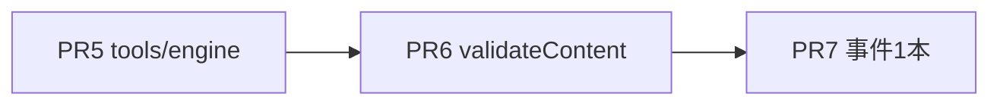

# 実装計画: M1（検証エンジンと事件1本）

## 結論

M1を3つのPRに分け、推論エンジン、DETECTIVESの検証実装、事件データ1本の順に作る。

実装より先にM1を置くのは、事件データの設計不備がゲームの死因として最も致命的であり、UIより先に潰すべきだからである（[設計.md](../設計.md)）。

M1の完了条件は、6人版・5人版の両方で検証7項目がCIでPASSし、机上で推理が成立することとする。

実装者への規律は [M0.md](./M0.md) の該当節を適用する。PRごとに再掲する。

## 作業単位と依存順

M0のPR0（リポジトリ基盤）が前提となる。
`shared/games/detectives`（型）はM2のPR8で作るが、事件データのスキーマ型はPR6で先に必要になるため、PR6で `shared/games/detectives` を新設する。

## PR5: 汎用推論エンジン

### 目的

事実の集合と規則の集合から到達集合を求める推論器を作る。DETECTIVESを知らない状態で完結させる。

### 読む文書

* [基本設計/06_推論エンジンと検証アルゴリズム.md](../基本設計/06_推論エンジンと検証アルゴリズム.md)の「エンジンの責務範囲」（この PR の主たる仕様）
* [ADR-0004](../adr/0004-事件データの静的JSON化とCI検証.md)、[ADR-0009](../adr/0009-部屋基盤とゲームモジュールの分離.md)

### 作るもの

`tools/src/engine/` に `saturate` と `isRequired` を実装する。
06に定義した `Rule` / `Saturation` の形をそのまま使う。

### 受入条件

| # | テスト内容 | 期待結果 |
| --- | --- | --- |
| 1 | 多段の規則を含む入力で、規則の並び順を変えて実行する | すべて同じ到達集合になる |
| 2 | `yields` が自分の `requires` に含まれる規則を与える | 停止し、反復上限で検証エラーになる |
| 3 | 単一経路の入力で `isRequired` | 必須と判定される |
| 4 | 2経路ある入力で `isRequired` | 不要と判定される |
| 5 | `support` から到達シンボルの導出元を辿る | 規則idが得られる |
| 6 | `grep -rn "detectives\|culprit\|lie\|testimony" tools/src/engine/` | 0件 |

### 禁止事項

* `value` の文字列を解釈しない。等号・時刻・場所の意味を規則として内蔵しない
* DETECTIVESの語彙を型名・変数名・コメントに使わない
* 検証7項目をこのPRに含めない。エンジンは判定基準を知らない

---

## PR6: DETECTIVESの検証実装

### 目的

検証7項目・追加リント・5人版導出・反例出力を実装し、`pnpm validate:content` を動く状態にする。

### 読む文書

* [基本設計/06_推論エンジンと検証アルゴリズム.md](../基本設計/06_推論エンジンと検証アルゴリズム.md)（判定手順の正本）
* [基本設計/04_事件データと検証.md](../基本設計/04_事件データと検証.md)（検証項目の意味と追加リント）
* [設計.md](../設計.md)の事件データモデル
* [ADR-0007](../adr/0007-犯人バリアントは実配役プレイヤーのレベルで抽選する.md)、[ADR-0008](../adr/0008-矛盾定義は嘘factを明示的に含める.md)

### 作るもの

* `shared/games/detectives/` に事件データのスキーマ型（`Case` / `Fact` / `Variant` / `Contradiction`）
* `server/games/detectives/` に `validateContent` の実装（7項目 + 追加リント + 5人版導出）
* `tools/src/validate-content.ts`（CLI。ゲームごとの `validateContent` を呼び分ける）
* 検証を落とすための不正な事件データ（テスト用フィクスチャ、`content/` の外に置く）

### 受入条件

| # | テスト内容 | 出典 |
| --- | --- | --- |
| 1 | 7項目それぞれについて、その項目だけを違反させたフィクスチャを用意し、当該項目だけが落ちる | 06 |
| 2 | 検証2で犯人自身が検査対象から除かれている（犯人を除いたケースを合格として数えていない） | 06 |
| 3 | 検証3が推移的に展開して所有者を数えている（多段推論のフィクスチャで確認） | 06 |
| 4 | 検証7で、2つのバリアントが同じ `contradictions` を共有する事件が落ちる | 06 |
| 5 | 5人版導出: 統合 → `requires5p` 適用 → バリアント除外の順で行われている | 06 |
| 6 | 統合後に所有者が1人になる規則を持ち `requires5p` 未指定の事件が検証エラーになる | 04 |
| 7 | `content/detectives/` が存在しないときスキップ、存在して0件のときエラー | 04 |
| 8 | 反例出力に、事件id・バリアント・人数版・項目番号と、06の表の情報が含まれる | 06 |
| 9 | 追加リント4項目（レベル1〜2の必須性、`hintJa` の和訳検出、英文長、バリアント数）が動く | 04 |

### 禁止事項

* エンジン（`tools/src/engine/`）にDETECTIVESの語彙を持ち込まない。判定基準はこのPR側に置く
* 5人版だけ検証項目を減らさない
* フィクスチャを `content/detectives/` に置かない（本番の事件として扱われる）

---

## PR7: 事件データ1本

### 目的

検証を通る事件を1本作り、CIに載せる。

### 読む文書

* [基本設計/04_事件データと検証.md](../基本設計/04_事件データと検証.md)の制作パイプラインと人手レビューのチェックリスト
* [構想v2.md](../構想v2.md)のレベル別ハンディキャップ
* [基本設計/06](../基本設計/06_推論エンジンと検証アルゴリズム.md)

### 作るもの

* `content/detectives/<スラッグ>.json` を1本
* キャラクター数と同数のバリアント
* 5人版のための `merge5p` と、必要な `requires5p`

### 受入条件

| # | 確認 | 期待結果 |
| --- | --- | --- |
| 1 | `pnpm validate:content` | 6人版・5人版の両方で7項目PASS |
| 2 | 人手レビュー | 04のチェックリスト4項目を確認し、結果を報告に書く |
| 3 | 机上プレイ | 各バリアントについて、矛盾に到達する会話の筋道を1つずつ文章で示す |
| 4 | CI | `content/detectives/` が存在する状態で `validate:content` が必須チェックとして動く |
| 5 | フォントサブセット | 事件の日本語フィールドがサブセットの入力に含まれ、CIの差分チェックが通る |

受入条件3は機械検証では代替できない。
「検証は通るが会話として成立しない事件」を弾くために行う。

### 禁止事項

* 検証を通すために検証側のコードを変更しない。落ちたら事件データを直す
* `hintJa` に文全体の和訳を書かない
* 実在の人物・差別的な設定・重すぎる犯罪を題材にしない

---

## M1の完了判定

* 6人版・5人版の両方で検証7項目がCIでPASSする
* PR7の受入条件3（机上プレイ）が全バリアントについて記録されている
* `tools/src/engine/` にDETECTIVESの語彙が現れない
