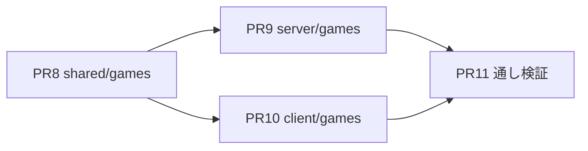

# 実装計画: M2（DETECTIVES本体）

## 結論

M2を4つのPRに分け、型 → サーバのゲームモジュール → クライアントの画面 → 通し検証の順に作る。

M2の完了条件は、実際の6人プレイで1事件を完走できることとする（[設計.md](../設計.md)）。
M2完了時点でリリースし、実プレイのフィードバックを得てからM3以降へ進む。

実装者への規律は [M0.md](./M0.md) の該当節を適用する。PRごとに再掲する。

PR8〜PR11は実装済みで、CIは通っている。残る完了条件は実プレイである（[既知の課題.md](../既知の課題.md)）。

## 作業単位と依存順

M0（共通コア）とM1（検証と事件1本）の完了が前提となる。
PR9とPR10はPR8のマージ後に並行できる。

## PR8: shared/games/detectives の型

### 目的

秘密情報・公開状態・結果の型を確定させる。

### 読む文書

* [基本設計/08_DETECTIVESゲームモジュール.md](../基本設計/08_DETECTIVESゲームモジュール.md)（この PR の主たる仕様）
* [設計.md](../設計.md)のDETECTIVES固有の型
* [ADR-0003](../adr/0003-サーバ権威と秘密情報の個別送信.md)

### 作るもの

`shared/games/detectives/src/` に次を置く。M1のPR6で作った事件データのスキーマ型と同居させる。

* ステージ定数（`briefing` / `investigation` / `voting` / `reveal`）
* `DetectivesPublic` / `DetectivesSecret` / `DetectivesResult` / `CastEntry`
* `action` のペイロード型（`ready` / `vote`）
* ゲーム固有のエラーコード定数（`invalid_stage` / `invalid_target` / `already_voted`）
* `constraints` と `questionTemplates` のレベル別定数（08の表）

### 受入条件

| # | 確認 | 期待結果 |
| --- | --- | --- |
| 1 | `pnpm check` | 成功する |
| 2 | `DetectivesPublic` の検査 | `isCulprit` / 証言テキスト / 投票先に相当するフィールドが存在しない |
| 3 | `DetectivesSecret` の検査 | 他プレイヤーのカードを持つフィールドが存在しない |
| 4 | `grep -rn "detectives" shared/core/` | 0件（共通コアが汚れていない） |
| 5 | constraints定数 | 全レベルに「証言は英語で読み上げる」が含まれる |

### 禁止事項

* `shared/core/` を変更しない。必要になったら停止条件に該当する
* 公開状態と秘密情報を同じ型で表現しない

---

## PR9: server/games/detectives（GameModule実装）

### 目的

ゲームのルールを純粋関数として実装する。

### 読む文書

* [基本設計/08_DETECTIVESゲームモジュール.md](../基本設計/08_DETECTIVESゲームモジュール.md)（この PR の主たる仕様）
* [設計.md](../設計.md)の配役アルゴリズムと状態機械
* [基本設計/05_ゲームモジュール.md](../基本設計/05_ゲームモジュール.md)
* [ADR-0007](../adr/0007-犯人バリアントは実配役プレイヤーのレベルで抽選する.md)、[ADR-0011](../adr/0011-部屋単位の通算スコアを持たない.md)、[ADR-0012](../adr/0012-ゲーム固有設定の検証をゲームモジュールに委ねる.md)

### 作るもの

* `GameModule` の全メソッド（`listContents` / `validateSettings` / `start` / `handleAction` / `onDeadline`）。`validateContent` はM1のPR6で実装済み
* `server/core/registry.ts` へのエントリ追加（1行）

### 受入条件

`pnpm test` で次がすべて通ること。Durable Objectを使わずに実行する。

| # | テスト内容 | 出典 |
| --- | --- | --- |
| 1 | 同じ `seed` と同じ参加者から、同じ配役・同じ犯人・同じ秘密情報が得られる | 08 |
| 2 | 5人時に `merge5p` で統合されたキャラクターへ配役されない | 08 |
| 3 | 全員がレベル1〜2の組で、最高レベルのプレイヤーが犯人になる | [ADR-0007](../adr/0007-犯人バリアントは実配役プレイヤーのレベルで抽選する.md) |
| 4 | `DetectivesPublic` に `isCulprit` / 証言 / 投票先が現れない | [ADR-0003](../adr/0003-サーバ権威と秘密情報の個別送信.md) |
| 5 | 犯人以外の `cards` に `isLie: true` が存在しない | 08 |
| 6 | 自分への投票が `invalid_target` で拒否され、状態が変わらない | 08 |
| 7 | 2回目の投票が `already_voted` で拒否され、1回目が保持される | 08 |
| 8 | 二重 `ready` が拒否されず、状態も変わらない | 08 |
| 9 | 接続中の全員が揃った時点で遷移し、切断者を待たない | 08 |
| 10 | 締切到達時、未投票者が集計の分母にも分子にも入らない | 08 |
| 11 | 最多票が並んだ場合に `outcome: 'culprit'` になる | [設計.md](../設計.md) |
| 12 | `lieCard.textEn` が犯人役プレイヤーのレベルの英文と一致する | 08 |
| 13 | `validateSettings` が範囲外の捜査時間を拒否する | [ADR-0012](../adr/0012-ゲーム固有設定の検証をゲームモジュールに委ねる.md) |

加えて、M0のPR2a・PR2bで作ったRoomDOのテストがスタブ `GameModule` のまま通り続けることを確認する。

### 禁止事項

* `handleAction` / `onDeadline` から storage・WebSocket・現在時刻・`Math.random()` に触らない
* `server/core/` を `registry.ts` の1行以外変更しない。必要になったら停止条件に該当する
* 事件データをクライアントへ配る経路を作らない。秘密が載るのは `secret` と `result` だけ

---

## PR10: client/games/detectives（4ステージの画面）

### 目的

ステージごとの画面を実装する。

### 読む文書

* [基本設計/02_クライアント.md](../基本設計/02_クライアント.md)の画面対応と配役カットイン
* [基本設計/08_DETECTIVESゲームモジュール.md](../基本設計/08_DETECTIVESゲームモジュール.md)
* [ビジュアルデザイン.md](../ビジュアルデザイン.md)
* [ADR-0010](../adr/0010-Svelte5とrunes構文の採用.md)

### 作るもの

* `briefing`（事件概要 → 伏せ面 → 配役カットイン → readyボタン）
* `investigation`（証言カード、制約表示、タイマー、L1-2の質問テンプレート、役柄の再確認）
* `voting`（容疑者グリッド、選択と確定）
* `reveal`（段階的な開示演出、振り返り）
* `client/app` のテーブルへ `detectives` を登録する

### 受入条件

| # | 確認 | 期待結果 |
| --- | --- | --- |
| 1 | 配役カットイン | `secret` 受信だけでは役柄の文字列がDOMに現れず、タップ後に現れる |
| 2 | `prefers-reduced-motion` | 溜めとワイプが無効化され、伏せ面とタップは残る |
| 3 | 証言カードの階層 | 英文が日本語ヒントより大きく高コントラストで表示される |
| 4 | 制約表示 | レベル1〜2の画面にも「証言は英語で読み上げる」が出る |
| 5 | 役柄の再確認 | 捜査中に再表示でき、毎回伏せ面を経由する |
| 6 | `grep -rn "reconnectToken" client/games/` | 0件 |
| 7 | 勝敗表示 | `result.outcome` をそのまま表示し、クライアントで集計していない |
| 8 | Wake Lock | 捜査・投票ステージ中に有効化され、非対応ブラウザで例外を投げない |

### 禁止事項

* 投票の集計・時間切れの判定・勝敗をクライアントで計算しない
* 日本語ヒントを英文より目立たせない
* `secret` の内容を自分以外に見せるUIを作らない
* レガシー構文を使わない

---

## PR11: 通し検証と実プレイ準備

### 目的

部屋作成から開示までの導線を自動検証し、実プレイの条件を整える。

### 読む文書

* [基本設計/02_クライアント.md](../基本設計/02_クライアント.md)のテスト観点
* [開発ガイド.md](../開発ガイド.md)のデプロイのタイミング

### 作るもの

* Playwrightの通しテスト
* 実プレイ用のデプロイ手順の確認

### 受入条件

| # | テスト内容 |
| --- | --- |
| 1 | 部屋作成 → 6人参加 → 開始 → ready → 捜査 → 投票 → 開示 が通しで動く |
| 2 | 捜査中にWebSocketを切断し、スナップショットが維持されたまま自動復帰する |
| 3 | 6人の `secret` がすべて異なり、他人のカードを含まない |
| 4 | 5人での参加時に5人版の事件が使われる |
| 5 | 全ステージを通し、`state` の受信内容に秘密が含まれない |

### 禁止事項

* テストを通すために受入条件を緩めない
* 固定待機で同期を誤魔化さない

---

## M2の完了判定

* PR8〜PR11がマージされ、CIが通る
* 実際の6人プレイで1事件を完走できる
* 実プレイで市民勝率を記録し、[設計.md](../設計.md)のリスク表「市民側の勝率が構造的に低い」の未検証項目に結果を追記する

実プレイは自動テストで代替できない。
「ゲームとして面白いか」「英語レベル配分が妥当か」はここでしか分からない（[開発ガイド](../開発ガイド.md)）。
