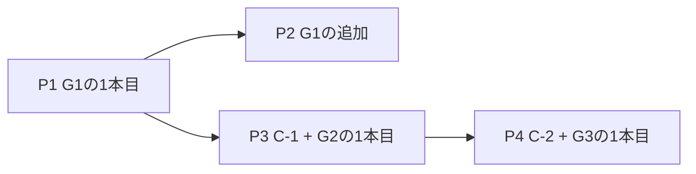

# 実装計画: ゲーム構想20案の収録計画

## 結論

[ゲーム構想.md](../ゲーム構想.md)の20案を、共通コアへの要求で3群に仕分ける。
群ごとに1本目を作り、2本目以降は同じ経路の反復として扱う。

各案のルールを具体化した案は[収録候補ゲームのルール案](../収録候補ゲームのルール案.md)に置く。
本文書は実装順・作業単位・受入条件を扱い、ルールの中身は扱わない。

20案のうち15案は原案のまま収録できる。
残る5案は不変条件との衝突があり、5案すべてルールの置き換えで収録できる形になった。

進行と得点が同一で設定値の差にすぎない3案を他の案へ統合したため、実装するモジュールは17本になる。

共通コアの変更が必要なのは2点だけである。
`action` ペイロードの長さ上限（本文書のC-1）と、手番制の扱い（C-2）である。

先回りの抽象化はしない。
20案に共通する部品（お題カード・提出フォーム・投票リスト・ラウンド進行）を共有パッケージへ切り出すのは、2本目を素朴に実装して重複が実際に現れた後とする。

本文書はP1（2本目のゲーム）のみPR単位まで分解する。
P2以降は着手時に分解する。実装順と収録可否の判断根拠を先に固定することが本文書の目的である。

## 3群への仕分け

仕分けの軸は「共通コアに何を要求するか」である。
ゲームの題材では分けない。実装順を左右する要因が共通コアへの要求だけだからである。

| 群 | 定義 | 案 | 共通コアへの要求 |
| --- | --- | --- | --- |
| G1 | 秘密の個別配布・ステージタイマー・投票・開示で足りる | 1, 3, 8, 9, 10, 12, 13, 14, 15, 18 | なし |
| G2 | プレイヤーが自由英文をサーバへ提出する | 2, 4, 5, 11, 16 | C-1（ペイロード長上限） |
| G3 | 1人ずつ順に操作する手番制を要する | 7, 19 | C-2（未検証） |

案17は案13へ、案20は案19へ統合した（[ルール案](../収録候補ゲームのルール案.md)の統合表）。
案6は案15へ統合し、自由交渉モードはG1、1語制約モードはG3に属する。

案5は原案では人間のゲームマスターが判定するためG1だったが、判定を文字列一致で表現できる規則に限定してG2へ移した。

### G1: 配布と投票で足りる案

| # | 案 | 判定方式 | コンテンツ | 実装 |
| --- | --- | --- | --- | --- |
| 13 | DON'T SAY IT（案17を含む） | 正解ボタンと違反ボタン | 人物名 + 禁止語5語 + 制約カード | 小 |
| 12 | ENGLISH RANKING | 秘密目標と確定順位の照合 | 5項目 + 目標カード6枚 | 小 |
| 8 | FAKE INTERVIEW | 秘密職業の投票当て | 職業リスト | 小 |
| 10 | WEREWOLF WITHOUT WEREWOLF | 制約の投票当て | 会話テーマ + 制約表 | 小 |
| 1 | BAD ENGLISH COURT | 陪審員の投票 | 事件のお題 + 陪審員指令 | 小 |
| 3 | WORST TOUR GUIDE | 秘密ミッションの投票当て | 場所カード + ミッション4件 | 小 |
| 18 | FIVE SECOND ENGLISH | 口頭進行（アプリは判定しない） | 質問リスト | 小 |
| 9 | PRESS CONFERENCE | 記者の秘密指令の達成投票 | 不祥事 + 秘密情報 + 指令表 | 中 |
| 15 | NPC FROM HELL（自由交渉モード） | NPC役の宣言 | NPC設定 + 隠し条件 + 応答例 | 中 |
| 14 | EMERGENCY ENGLISH | 生還の成否を投票 | 状況カード + 共通イベントプール | 中 |

判定方式の欄は、勝敗を誰がどう決めるかを示す。
アプリは英語を理解しないため（不変条件1）、正しさの判定は投票・ホスト操作・文字列一致・照合のいずれかに落ちる。

案3は写真を使わない形にした。
場所名と日本語1行の説明で成立するため、素材の権利処理という前工程が消え、コンテンツ制作の重さが中から小に下がった。

案14はイベントを共通プールから抽選する形にしたため、当初の見積り（大）から中に下がった。

### G2: 自由英文の提出を伴う案

| # | 案 | 提出物 | 投票の意味 | 正解 |
| --- | --- | --- | --- | --- |
| 11 | WHO WROTE THIS? | 質問への英文回答 | 誰が書いたかの当て | あり（照合可能） |
| 16 | BAD TRANSLATOR | 日本語お題の英訳 | 一番面白い訳の選出 | なし |
| 2 | ENGLISH AUCTION | 指定語を含む英文 | 好きな回答へのチップ配分 | なし |
| 4 | LIAR DICTIONARY | 見慣れない単語の語義 | 本物の語義の当て | あり（コンテンツに収録） |
| 5 | SECRET RULE ENGLISH | 規則に合わせた英文 | 規則の当て | あり（サーバが判定） |

案11、16、2、4の進行は同一である。
お題配布、各自の英文提出、シャッフルして一斉開示、投票、得点開示の5ステージになる。
差分は投票の意味と得点計算だけであり、ステージ構造は共有できる。

案5だけは提出と開示を5ラウンド繰り返し、投票を最後に1回だけ行う。
他の4案とステージ構造が異なるため、モジュールは分ける。

提出物は開示ステージまで公開状態に載せない。
`gameSecret` に蓄積し、開示時に `result` で配る（[ADR-0003](../adr/0003-サーバ権威と秘密情報の個別送信.md)、[ADR-0015](../adr/0015-ゲームモジュールの秘密状態を共通コアが預かる.md)）。
公開状態に載せてよいのは提出済み人数だけである。

案11の作者当てと案5の規則判定は、照合と文字列一致だけで採点できる。
英文の意味を判定しないため、不変条件1に抵触しない。

### G3: 手番制を伴う案

| # | 案 | 手番の内容 | 可視範囲 |
| --- | --- | --- | --- |
| 19 | MAKE IT WORSE（案20を含む） | 語数上限まで追記 | 全文を全員に公開 |
| 7 | ENGLISH TELEPHONE BOMB | 受け取った文を言い換えて渡す | 直前の1件のみ手番者に公開 |
| 15 | NPC FROM HELL（1語制約モード） | 1語だけ提出 | 全文を全員に公開 |

案7の禁止ワードと案19の語数上限は、文字列一致と計数で機械的に判定できる。
いずれも英語の理解に当たらないため、サーバ側で判定してよい。

案15の1語制約モードは、自由交渉モードの実装後に追加する。
手番制の可否（C-2）が判明する前に着手しない。

## 不変条件との衝突

### ランタイムAIを要求する3案（ADR-0001）

案4の原案は架空語を使い、本物らしい正解をAIに作らせる。
実在する珍しい単語の実際の語義を収録する方式に変えると、架空語の生成も正解の生成も不要になる。
[ADR-0001](../adr/0001-ランタイムAI不使用.md)が禁じるのは本番アプリからのAPI呼び出しであり、開発時のコンテンツ生成は許容されているが、この案では生成そのものが要らなくなる。

案6と案15のAI NPCは事前生成に落とせない。
NPCの応答が自由入力に依存するため、事前生成では分岐木になり自由入力を受けられない。

NPC役を人間プレイヤー1人に割り当て、隠し攻略条件と英語の応答例をそのプレイヤーへ `secret` で配る。
この形なら現在の機構で成立する。
原案どおりのAI NPCは実装しない。

### 英語の意味判定を要求する1案（不変条件1）

案5の原案は、ゲームマスターが英文の規則適合を判定する。

規則を文字列処理で判定できるものに限定すれば、アプリが判定役を務められる。
語数、末尾の文字、指定した語彙リストに載る語の有無で表現できる規則だけを収録する。
不規則動詞を含む「過去形を使う」も、語彙リストをコンテンツ側に持たせれば文字列一致で判定できる。

代償として、提出が発話からテキスト入力に変わる。
このため案5はG1からG2へ移り、C-1が前提になる。
判定役の固定を解消できたため、当初の保留は解除した。

### 得点の持ち越し（ADR-0011）

G2とG1の一部は、複数ラウンドで得点を積む形式が自然である。
得点をゲーム1回の `gameState` 内に持ち、部屋へ持ち越さなければ[ADR-0011](../adr/0011-部屋単位の通算スコアを持たない.md)に抵触しない。
ADRの改訂は不要である。

1晩で3ゲーム遊ぶ場合の通算得点をどう扱うかは決めていない（[ルール案](../収録候補ゲームのルール案.md)の未解決の論点）。

### 短時間の判定を要求する1案

案18は5秒という判定単位を持つ。
Durable Objectのアラームは発火時刻の精度を保証しないため、5秒級の勝敗判定をサーバに持たせると結果がぶれる。

締切表示はクライアントが `serverNow` 補正で描画できるため、アプリがお題表示とカウントダウンのみを担当する形にする。
この形ではアプリの機能がタイマーだけになるため、優先度は最下位とする。

## 共通コアに必要な変更

### C-1: actionペイロードの長さ上限

現状、`parseClientMessage` は `action` の残余キーを検証せずそのまま通す（`shared/core/src/validate.ts`）。
DETECTIVESの `action` はプレイヤーIDしか運ばないため、上限がなくても問題が出ていない。

G2の自由英文をこの経路に載せると、提出テキストが `gameSecret` と `result` を経由して全員へ再配信される。
上限がなければ1件あたりのサイズに歯止めがなく、SQLite rows writtenとメッセージ量の両方を押し上げる。

`SETTINGS_MAX_CHARS` と同じ方式（`JSON.stringify` の長さ）で、`action` のペイロードに上限を課す。
上限値は512文字を起点とし、G2の1本目の実プレイで見直す。

作業単位は `shared/` 単独PRとし、[基本設計/03](../基本設計/03_プロトコル.md)と[01](../基本設計/01_サーバ.md)の更新を同PRに含める。
共通コアの制約を1つ増やす判断であるため、ADRを追加する。

### C-2: 手番制の扱い（未検証）

[基本設計/05](../基本設計/05_ゲームモジュール.md)の収録候補表は、手番制を「共通コアへの追加要求」と記載している。

現在の実装を読む限り、手番制はゲームモジュール側で表現できる。
公開状態に手番プレイヤーを持ち、`handleAction` で `playerId` を照合して他者を `reject` し、`GameTransition.deadlineSeconds` を手番ごとに返せばよい。
`applyTransition` は毎回 `deadline` を再計算してアラームを張り直すため、手番ごとの締切更新は既存の経路で動く。
手番プレイヤーが切断した場合の飛ばしも、`room.players[].connected` が `onDeadline` に渡るためモジュール側で判定できる。

ただしこれはコード読解による見通しであり、動作確認はしていない。
G3の1本目で薄いプロトタイプを作って確認する。
成立すれば05の記載を訂正し、成立しなければ05の手順6に従って境界表の議論に戻す。

## 収録フェーズ

| フェーズ | 内容 | 完了条件 |
| --- | --- | --- |
| P1 | G1の1本目（案13 DON'T SAY IT） | 共通コアを変更せずに2本目が動く |
| P2 | G1の追加（案12、10、9、8、1、3、15、14の順） | 1本あたり型・モジュール・画面・お題の4PRで収録できる |
| P3 | C-1 + G2の1本目（案11 WHO WROTE THIS?）、以降16、2、4、5 | 自由英文の提出と匿名開示が通る |
| P4 | C-2 + G3の1本目（案7 TELEPHONE BOMB）、以降19、案15の1語制約モード | 手番制の可否が判明し、05の記載が実装と一致する |

P1を案13にするのは、[設計.md](../設計.md)のM3が「DON'T SAY IT または ESCAPE」を候補としており、案13がそのDON'T SAY ITに相当するためである。
M3の完了条件「共通コアを変更せずに2本目が動く」をそのまま使える。

P2の順序は実装の軽さで並べた。
案12を先頭に置くのは、秘密配布と照合だけで成立し、会話の分量が最も多いためである。

P3を案11にするのは、G2の5案の中で採点がサーバ側の照合で完結し、投票の意味が最も単純なためである。
自由英文の経路そのものの検証に集中できる。
案5をG2の最後に置くのは、規則の判定関数という他案にない仕組みを持ち込むためである。

P2をP3より前に置く理由はない。
P1の完了後、P2とP3は並行できる。実プレイのフィードバックで順序を決める。

## P1の完了状況

P1は2026-08-19にPR #3（マージコミット `d20a01e`）で `dev` へ入った。

| 条件 | 結果 |
| --- | --- |
| 共通コアを変更せずに2本目が動く | 満たした。`5cf8969` の時点で `shared/core` `server/core` `client/core` を1行も変えずに通しE2Eが通っている |
| PR-4の受入条件1〜3・5 | 満たした（`validate:content` / `e2e` / ゲーム切り替え / ロードマップの一致） |
| PR-4の受入条件4（6人で15分以内） | 未判定。人の発話が要るため自動検証では測れない（[既知の課題](../既知の課題.md)） |

PR #3の後半では、2本目を入れて初めて見つかった1本目の積み残しを同じPRで是正した。
内訳はロビーの語彙と設定の記述子化（[ADR-0018](../adr/0018-ロビーの表示と設定はゲームモジュールが記述子で配る.md)）、演出プリミティブの共通化、遊び方をゲーム単位で開く形への変更である。
いずれも2本目を動かすために必要だった変更ではない。

次に決めるのはP2とP3のどちらを先に進めるかであり、実プレイのフィードバックを待つ。

案18はどのフェーズにも含めない。
アプリの役割がカウントダウンだけであり、他案の収録を優先する。

## P1のPR分解

案13 DON'T SAY IT を5PRで作る。
ルール仕様の確定を先行させ、実装3PRは既存のゲーム追加手順（[基本設計/05](../基本設計/05_ゲームモジュール.md)）に従う。

実装者への規律は[M0.md](./M0.md)の該当節を適用する。

### PR-0: 基本設計09の執筆

ルールが正本として存在しないため、実装より先に書く。
[ルール案](../収録候補ゲームのルール案.md)の案13を入力とし、そこで未定のまま残した点を決めて09に書く。

作るもの: `docs/基本設計/09_DONTSAYITゲームモジュール.md`。
ステージ定義、説明者の選出、禁止語の提示範囲、正解申告と違反申告の受理、得点、対応人数、コンテンツ形式と検証項目を記載する。

コンテンツ形式には案17 CHARADES+ の制約カードを含める。
別ゲームにせず同一モジュールのコンテンツとして扱うため、形式の設計時に織り込む必要がある。

| # | 確認 | 期待結果 |
| --- | --- | --- |
| 1 | 09の記載 | ステージ・action・公開状態・秘密情報・結果がすべて定義されている |
| 2 | 秘密の切り分け | お題語を持つフィールドが公開状態側に存在しない |
| 3 | コンテンツ形式 | 制約カードを持つ案17のお題を同じ形式で表現できる |
| 4 | docs/README.mdの正本マップ | 09の行が追加されている |
| 5 | 05の収録候補表 | DON'T SAY ITの行が実装状況と一致している |

### PR-1: shared/games/dontsayit の型

作るもの: ステージ定数、公開状態・秘密情報・結果の型、`action` のペイロード型、ゲーム固有エラーコード。

| # | 確認 | 期待結果 |
| --- | --- | --- |
| 1 | `pnpm check` | 成功する |
| 2 | 公開状態の型 | お題語・禁止語を持つフィールドが存在しない |
| 3 | `grep -rn "dontsayit" shared/core/` | 0件 |

禁止事項: `shared/core/` を変更しない。C-1はP3の作業であり、このPRに混ぜない。

### PR-2: server/games/dontsayit のGameModule

作るもの: `GameModule` 実装、`validateContent`、ユニットテスト。
`server/core/src/registry.ts` に1行追加する。

`GameModule` は `title` のほかに `tagline` `icon` `contentLabelJa` `settingsFields` を要求する。
ゲームを増やすたびに、選択画面の1行説明とアイコン、ロビーの見出しと設定項目を決める作業が入る（[ADR-0018](../adr/0018-ロビーの表示と設定はゲームモジュールが記述子で配る.md)）。

このPRは共通コア以外の3箇所へ変更が波及する。

* `eslint.config.js`: 検査3（ゲームIDリテラルの出現禁止）の対象を新しいゲームIDへ拡張する。現在の `noDetectivesLiteral` はDETECTIVES専用である
* `tools/src/validate-content.ts`: `validators` 配列に1行追加する
* 同ファイルの単一ファイル検証経路: 現在 `runValidationOnFile` へ `validateCase` を直接渡しており、ゲームが増えるとパスに応じた振り分けが必要になる

3点目はゲームが1本の間は現れなかった既存の制約であり、2本目で初めて問題になる。

| # | 確認 | 期待結果 |
| --- | --- | --- |
| 1 | `pnpm check` / `pnpm test` | 成功する |
| 2 | `handleAction` / `onDeadline` の純粋性 | Durable Objectなしで呼べ、同じ入力に同じ出力が返る |
| 3 | `grep -rn "dontsayit" server/core/src/` | `registry.ts` の1行のみ |
| 4 | `pnpm validate:content` | 引数なしと単一ファイル指定の両方で新ゲームのコンテンツが検証される |
| 5 | 公開状態の検査 | お題語が `gameState` に現れないことを検査する自動テストがある |

### PR-3: client/games/dontsayit の画面

作るもの: ステージごとの画面、`guide`、`stage-labels`。
`client/app/src/App.svelte` の3つのローダー表に各1行追加する。

DETECTIVESの `StageTimer.svelte` 等をこの時点で共有パッケージへ抽出しない。
重複が現れた箇所を記録し、抽出の判断はPR-5で行う。

| # | 確認 | 期待結果 |
| --- | --- | --- |
| 1 | `pnpm check` | 成功する |
| 2 | 自由英文の表示 | このPRでは自由英文を表示しない（G2の作業） |
| 3 | `client/core/` の差分 | 0件 |
| 4 | 実機確認 | スマホ幅で操作でき、ホスト画面にステージ名が出る |

### PR-4: content/dontsayit と通し検証

作るもの: お題データ、Playwrightの通し検証、ドキュメント更新。

| # | 確認 | 期待結果 |
| --- | --- | --- |
| 1 | `pnpm validate:content` | PASSする |
| 2 | `pnpm e2e` | 部屋作成からDON'T SAY ITの開示まで通る |
| 3 | ゲーム切り替え | DETECTIVES完走後に `nextGame` でDON'T SAY ITを選べる |
| 4 | 1ゲームの所要時間 | 6人・人数分のラウンドで15分以内に収まる（超える場合はラウンド数を09で見直す） |
| 5 | 設計.mdのロードマップ | M3の内容が実装と一致している |

### PR-5: 共有部分の抽出（条件付き）

PR-2とPR-3で記録した重複を見て、抽出するかを判断する。

P1の実装で現れた重複は次のとおり。

| 箇所 | 重複の程度 | 備考 |
| --- | --- | --- |
| `server/games/*/rng.ts` | `createRandom` / `shuffle` は一致 | DETECTIVESのみ `pickOne` / `pickWeighted` を追加で持つ |
| `client/games/*/StageTimer.svelte` | コードは一致（差分は先頭コメントのみ） | 上部固定のタイマーバー |
| `client/games/*/wake-lock.svelte.ts` | コードは一致（差分は先頭コメントのみ） | Screen Wake Lock API の取得と解除 |
| `client/games/*/StageGuide.svelte` | 構造が同じ | 文言はゲーム固有。共通化できるのは枠と配色だけ |
| `client/games/*/index.ts` `guide.ts` `stage-labels.ts` | 定型 | 各3行。抽出しても行数が減らない |
| 得点表（`ScoreBoard.svelte`） | DETECTIVES側に対応物なし | 得点を持つゲームが2本目に出た時点で判断する |
| `handleReady`（全員の収集と遷移） | ほぼ一致 | 収集対象と遷移先だけが違う。共通コアへ上げてはならない（[05](../基本設計/05_ゲームモジュール.md)の判断基準） |

### 判断の結果（2026-08-20）

3本目（案12 ENGLISH RANKING）の着手時に判断した。
案12はタイマー・シャッフル・Wake Lockの3つとも使うため、上の3箇所はいずれも3つ目のコピーになる。

**`_kit` は新設せず、共通コアへ移した**（[ADR-0020](../adr/0020-ゲーム間で重複する部品は共通コアへ置く.md)）。
`client/core` に `SecretCover` と演出プリミティブが既に入っており、ゲームモジュールが使う部品を共通コアが提供する形が成立していたためである。
`_kit` を作ると同じ性質の部品が置き場所で2系統に分かれ、3ファイル約120行のために workspace パッケージが2つ増える。

移した先は `shared/core/src/rng.ts`（`createRandom` / `shuffle`）、`client/core/src/components/StageTimer.svelte`、`client/core/src/wake-lock.svelte.ts` である。
`pickOne` / `pickWeighted` は利用者がDETECTIVESだけなので移していない。
`StageGuide.svelte` と `handleReady` はゲーム固有の語彙を含むため、重複していても各ゲームに置いたままにする。

## リスク

| リスク | 影響 | 対策 |
| --- | --- | --- |
| 自由英文の表示でスクリプトが混入する | 同室プレイヤーへのXSS | Svelteは標準でエスケープする。`{@html}` の使用は `svelte/no-at-html-tags` が既にerrorで有効であり（`eslint-plugin-svelte` のrecommendedに含まれる）、追加設定は不要 |
| 自由英文に不適切な内容が入る | 場が壊れる | 同室プレイのため運用で足りる。語彙フィルタは持たない（アプリは英語を理解しない） |
| 手番制がモジュール側で表現できない | G3の3本が保留、共通コアの改修が必要 | P4で薄いプロトタイプを先に作る。成立しなければ05の手順6へ戻す |
| 手番リレーで書き込みが増える | rows writtenの消費 | 6人×10手番で `applyTransition` が60回、1回あたり数行のため1ゲーム200行程度。日次10万行に対して余裕がある。実測はP4で取る |
| 1ゲームが長すぎる | 1晩で3ゲーム遊べない | 人数分のラウンドを回す案（13、11、8）は6人で10分を超える見込みである。未実測であり、P1のPR-4で所要時間を測る |
| ゲーム数が増えてロビーの選択UIが破綻する | ゲームを選べない | 画面は動的importで分かれている。選択画面は `tagline` と `icon` で1行説明とアイコンを持つ。ゲームが5本を超えた時点で一覧の並べ方を見直す |
| NPC役の演技力に依存する | 案15が成立しない | 応答例を配って負担を下げ、NPC役の抽選をレベルで重みづける（ADR-0016と同じ手法） |
| コンテンツ制作が律速になる | 収録しても遊べない | お題系は事件データより軽い。写真とイベント列を廃した結果、大の見積りは残っていない |
| 提出物の匿名性が壊れる | ゲームの成立条件が崩れる | 提出テキストを公開状態に載せないことを検査する自動テストを、G2の各ゲームに常設する |
