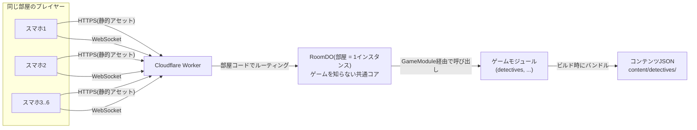
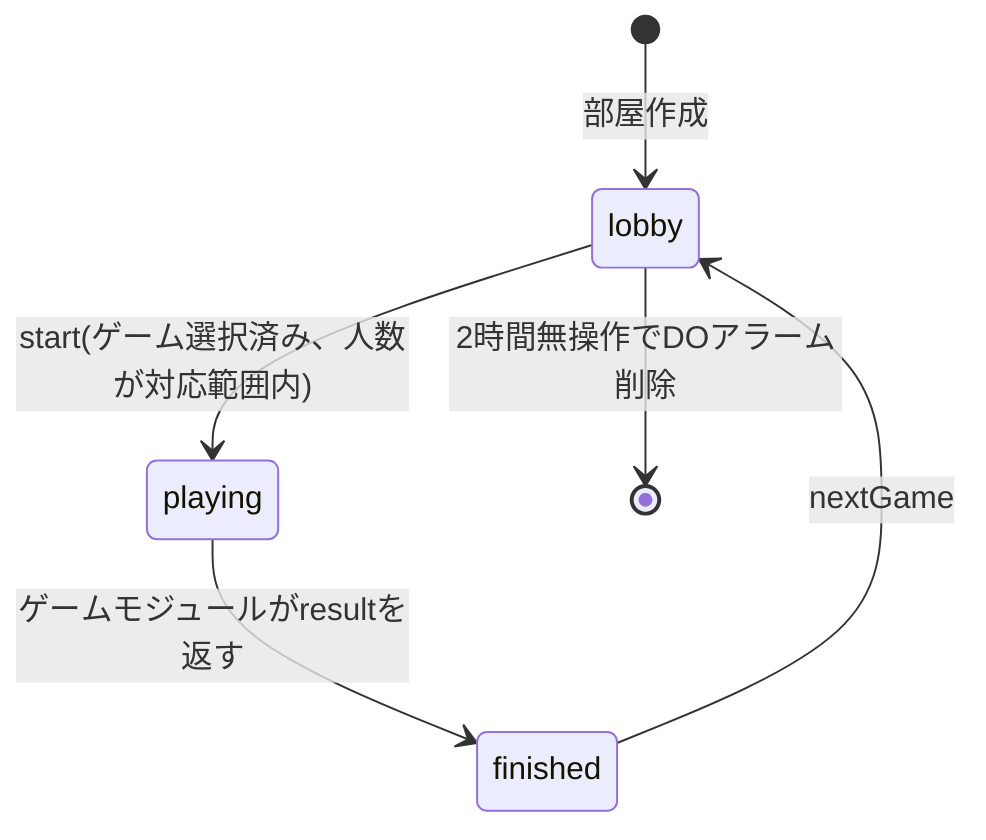
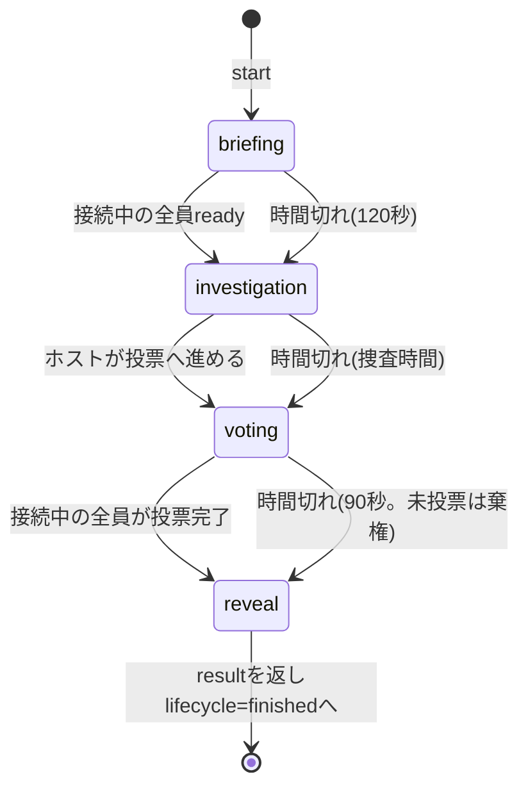

# 設計書: BEB Party（仮称）

## 結論

スマホブラウザで動くSPAを Cloudflare Workers の静的アセット配信で提供し、部屋ごとのリアルタイム同期を Durable Object 1個で行う。

コードは「ゲームを知らない共通コア」と「ゲーム1本ごとのモジュール」の2層に分ける（[ADR-0009](./adr/0009-部屋基盤とゲームモジュールの分離.md)）。
BEB Partyは複数ゲームの詰め合わせであり、MVPで収録するのはENGLISH DETECTIVES 1本である。

サーバの状態は部屋のライフサイクル内にのみ存在し、データベースは持たない。

コンテンツ（事件データ等）は静的JSONとしてリポジトリに置き、整合性検証をCIで行う。DETECTIVESの検証は前方推論で行う。

すべてCloudflare無料枠の範囲で動作し、運用費は¥0である。

前提となるプロダクト要件は [構想v2](./構想v2.md)、共通コアとゲームモジュールの境界は [基本設計/05_ゲームモジュール.md](./基本設計/05_ゲームモジュール.md) を正とする。

## 全体アーキテクチャ



構成要素は4つに収まる。

* **Worker**: 静的アセット（SPA本体）の配信、`GET /api/catalog`、`/room/:code/ws` へのWebSocketアップグレードのDOへの中継
* **RoomDO**: 部屋1つにつき1インスタンス。全接続のWebSocketを保持し、部屋のライフサイクルとステージ進行を駆動する。ゲームのルールは持たない。WebSocket Hibernation APIを使い、待機中のメモリ課金を回避する
* **ゲームモジュール**: ステージ定義・配役・秘密情報・ルール判定・結果生成・コンテンツ検証。ゲーム1本につき1つ。RoomDOは `GameModule` インターフェース経由でのみ呼ぶ
* **コンテンツJSON**: 本体（DETECTIVESでは facts / variants / reveal）はクライアントへ配らず、サーバだけが読む。秘密の漏洩を構造的に防ぐ。ホストの選択に必要な公開メタ情報のみ `GET /api/catalog` で配る

### DBを持たない判断

部屋は数時間で消える揮発データしか持たないため、永続化層は不要である。

部屋の状態はDOのインメモリ + Hibernation対応のための `ctx.storage`（DO内蔵の無料ストレージ）に置く。
部屋は最終アクセスから2時間でアラーム削除する。

将来スコア履歴などを永続化したくなった場合はD1（無料枠あり）を追加するが、MVPでは採用しない。

## 無料枠と想定負荷

Cloudflare無料プランの制限と、想定負荷の見積りを対比する。

| リソース | 無料枠 | 想定負荷（1セッション: 6人×1時間） | 判定 |
| --- | --- | --- | --- |
| Workersリクエスト | 10万/日 | 初回ロード数十件 + WS確立6件 | 問題なし |
| DOリクエスト | 10万/日 | WSメッセージ受信 数百件程度（捜査中は生声会話でメッセージが流れない） | 問題なし |
| DO実行時間 | 13,000 GB秒/日 | Hibernation利用でイベント処理時のみ課金対象。1セッション数GB秒以下 | 問題なし |
| DOストレージ | 5GB（SQLite backend） | 部屋状態は数KB×同時部屋数 | 問題なし |
| SQLite rows written | 10万/日（アカウント単位） | 状態が変わるメッセージ（join・configure・action等）ごとに数行。1セッション数百行 | 問題なし。ただし**最初に枯渇する枠**であり、メッセージ流量の制限で守る（[ADR-0017](./adr/0017-メッセージ流量の制限はインメモリで持つ.md)） |
| 静的アセット配信 | 無制限 | — | 問題なし |

友人グループ数組が同時に遊ぶ規模なら、無料枠の1%も使わない。

無料プランでDurable Objectを使う条件が2つある。どちらも実装制約になる。

第一に、無料プランで利用できるのはSQLiteストレージバックエンドのDurable Objectのみである。
key-valueバックエンドは有料プラン専用のため、`wrangler.jsonc` のマイグレーションを `new_sqlite_classes` で宣言する必要がある（詳細は [基本設計/01_サーバ.md](./基本設計/01_サーバ.md)）。
`ctx.storage` のkey-value APIはSQLiteバックエンド上でも使えるため、状態の持ち方は変わらない。

第二に、WebSocket Hibernation APIの使用は必須である。
標準のWebSocket処理では接続維持中ずっと実行時間が課金対象となり、無料枠の実行時間を消費し続けるためである。
特にDETECTIVESは捜査フェーズ10分超の間ほぼ無通信でWSを維持するため、Hibernationの有無が効く。

## フロントエンド

* **構成**: Vite + Svelte 5 + TypeScript のSPA 1本。ビルド成果物をWorkerの静的アセットとして配信する。リアクティビティはrunesで書く（[ADR-0010](./adr/0010-Svelte5とrunes構文の採用.md)）
* **選定理由**: バンドルが小さく、スマホ回線での初回ロードが速い。状態同期はサーバ権威なのでクライアント側の状態管理ライブラリは不要
* **UI前提**: スマホ縦持ち専用でよい。ホスト画面（ステージ名とタイマーの大画面表示）は同じSPAの表示モードとして任意提供する
* **多言語**: UIは日本語固定。証言カード・事件文書内のみ英語
* **ビジュアル**: 配色・書体・モーションの規定は [ビジュアルデザイン指針](./ビジュアルデザイン.md) を正とする

サーバを権威とし、クライアントは受信した状態スナップショットを描画するだけの薄い実装にする。
犯人情報や他人の証言はそもそも自分の端末に届かないため、DOM改変によるチートは構造的に成立しない。

## 事件データモデル

事件データは推理の骨格（機械検証の対象）と、表示テキスト（レベル別英文）を分離する。

```jsonc
// content/detectives/cafe-theft.json
{
  "id": "cafe_theft_v1",
  "playerCount": [5, 6],
  "title": "The Missing Laptop",
  "briefing": {
    "ja": "カフェで客のノートPCが盗まれた…",
    "en": "A laptop was stolen at Riverside Café between 14:00 and 14:30..."
  },
  "characters": [
    {
      "id": "part_timer",
      "name": "Aoi (part-time staff)",
      "recommendedLevel": 1,
      "merge5p": null          // 5人時に統合される先。ESCAPE 5人版と同じ方式
    }
    // ... 6人分
  ],
  "facts": [
    {
      "id": "f1",
      "owner": "part_timer",
      "value": "customer_in_red_left_at=14:10",   // 検証用の構造化値
      "disclosure": "free",                        // free | on_question_only
      "text": {                                    // レベル1〜5すべて必須(ADR-0007)
        "1": "Red jacket. Left 14:10.",
        "2": "The man in the red jacket left at 14:10.",
        "3": "I remember the guy in the red jacket leaving around ten past two.",
        "4": "Now that you mention it, the one in red slipped out just after ten past.",
        "5": "I couldn't swear to it, but I believe the gentleman in red had already left by a quarter past."
      },
      "hintJa": "red jacket = 赤い上着 / left = 出た"   // 語義のみ。文全体の和訳は書かない
    }
    // ...
  ],
  "variants": [
    {
      "culprit": "regular_customer",
      "lie": {
        "replaces": "f9",                          // 犯人の正直な証言f9を差し替える
        "value": "claims_was_at_counter_at=14:15",
        "text": { "1": "...", "2": "...", "3": "I was ordering at the counter at 14:15.", "4": "...", "5": "..." }
      },
      "contradictions": [
        {
          // 嘘factを必ず含める(ADR-0008)。f9=嘘, f1/f4=別々の他者の正直な証言
          "requires": ["f9", "f1", "f4"],
          "requires5p": null,                      // merge5pで所有者が統合される場合の上書き
          "yields": "culprit_alibi_broken",
          "meaningJa": "f9の主張をf1とf4に突き合わせると、14:15にカウンターには誰もいなかったことが分かる"
        }
      ]
    }
    // ... 犯人候補ごとのバリアント(原則キャラクター数と同数)
  ],
  "reveal": {
    "timelineEn": ["14:05 ...", "14:12 ..."],      // 真相タイムライン(レベル3相当の平易な英文)
    "keyExpressions": [
      { "en": "I was about to leave when...", "ja": "ちょうど出ようとしていたら…" }
    ]
  }
}
```

### 整合性検証（CI）

`tools/validate-content.ts` が全事件×全バリアント×対応人数に対して、前方推論で次を機械検証する。

| 検証 | 内容 |
| --- | --- |
| 可解性 | 全員の正直な証言 + 嘘を投入すると、矛盾が導出され犯人が一意に特定できる |
| 全員必須 | 任意の1キャラクターの証言を除くと、犯人特定に到達しない |
| 単独不可 | どの矛盾も、犯人以外の2人以上の証言を要求している（1人の証言だけで嘘が割れない） |
| 冤罪なし | 嘘factを投入しない状態では矛盾が1つも導出されない（犯人以外を指す推論経路がない） |
| 未使用なし | どの証言も少なくとも1つの推論経路に寄与する |
| 表示完全性 | 全factにレベル1〜5すべての英文とhintJaが存在する（[ADR-0016](./adr/0016-犯人バリアントは重みつき抽選で選ぶ.md)） |
| バリアント非干渉 | あるバリアントの嘘を投入したとき、他のバリアントの矛盾が発火しない |
| 犯人が握らない | 矛盾の成立に、犯人自身の証言（嘘カードを除く）を必要としない |

これは元構想ESCAPEの再検算と同型であり、同じ推論エンジンを将来ESCAPEモードでも使う。
検証項目の意味・追加リント・制作パイプラインは [基本設計/04_事件データと検証.md](./基本設計/04_事件データと検証.md)、判定アルゴリズムと推論エンジンの設計は [基本設計/06_推論エンジンと検証アルゴリズム.md](./基本設計/06_推論エンジンと検証アルゴリズム.md) を正とする。

### 配役アルゴリズム

参加者をレベル降順に並べ、キャラクターを `recommendedLevel` 降順に並べて対応させる。
同レベル帯はシャッフルする。
5人時は `merge5p` 指定に従いキャラクターを統合し、証言を統合先へ寄せる。

犯人バリアントは配役確定後に抽選する。
配役されたキャラクター全員を対象とし、「配役されたプレイヤーの自己申告レベルが3以上」のキャラクターを3倍の重みで引く。
該当が無い場合（全員レベル1〜2の組）は、最もレベルが高いプレイヤーのキャラクターを選ぶ。
最高レベルのプレイヤーが複数いる場合はその中から抽選する（固定で選ぶと初級者だけの組で犯人が毎回同じになる）。

この重みをキャラクターの `recommendedLevel` ではなく実プレイヤーのレベルで判定する理由と、候補を絞り込まない理由は [ADR-0016](./adr/0016-犯人バリアントは重みつき抽選で選ぶ.md) を正とする。

## ランタイムデータモデル

TypeScriptの型定義を `shared/` に置き、クライアント・サーバで共有する。
共通コアの型は `shared/core/`、ゲーム固有の型は `shared/games/<id>/` に置く。

### 共通コア（ゲーム非依存）

```typescript
type Level = 1 | 2 | 3 | 4 | 5;

interface Player {
  id: string;          // 公開ID。全員に配られる。ゲーム内の対象指定に使う
  name: string;
  level: Level;
  icon: PlayerIconId;  // 本人が選んだアイコンのID。絵文字そのものは載せない(ADR-0022)
  connected: boolean;
  isHost: boolean;     // ホスト切断時は接続中の最古参加者へ自動移譲される
}

interface Room {
  code: string;        // 4文字(英大文字+数字, I/O/0/1を除く)。DOのidFromNameのキー
  lifecycle: 'lobby' | 'playing' | 'finished';
  players: Player[];
  gameId?: string;     // 選択中のゲーム
  contentId?: string;  // 選択中のコンテンツ(事件・お題セット等)
  stage?: string;      // ゲーム固有のステージid。共通コアは中身を解釈しない
  deadline?: number;   // 現ステージの締切(epoch ms)。タイマーはサーバ権威
  gameState?: unknown; // ゲーム固有の公開状態。秘密を入れない
}

// カタログ。GET /api/catalog で配る
interface GameSummary {
  id: string;
  title: string;
  playerCount: [number, number];
  contents: ContentSummary[];
}
```

`GameModule` インターフェースと `GameTransition` の定義は [基本設計/05_ゲームモジュール.md](./基本設計/05_ゲームモジュール.md) を正とする。

再接続用の秘密値 `reconnectToken` は `Player` に含めない。
`joined` メッセージで本人にのみ渡し、DO側の秘密状態で保持する（[ADR-0006](./adr/0006-公開IDと再接続シークレットの分離.md)）。

### DETECTIVES固有

```typescript
// stage: 'briefing' | 'investigation' | 'voting' | 'reveal'

// secret.payload として各プレイヤーへ個別送信される
interface DetectivesSecret {
  characterId: string;
  isCulprit: boolean;
  cards: TestimonyCard[];        // 犯人は嘘カードが差し替え済みで isLie: true が付く
  constraints: string[];         // レベル別制約の表示文言("断定表現は使えません"等)
  questionTemplates?: string[];  // レベル1-2のみ
}

// 事件の公開メタ情報(ContentSummaryの実装)
interface CaseSummary {
  id: string;
  title: string;
  playerCount: [number, number];
  briefingJa: string;
}
```

`isCulprit` のような概念を `shared/core/` に置かないことがこの分離の要点である。
犯人が存在するのはDETECTIVESだけであり、共通コアはその存在を知らない。

## WebSocketプロトコル

メッセージはJSONで、クライアント→サーバは操作、サーバ→クライアントは状態通知とする。

メッセージの種類は次の通り。ペイロード・受理条件・順序保証・バージョニングは [基本設計/03_プロトコル.md](./基本設計/03_プロトコル.md) を正とし、本書では重複して記載しない。

* C→S（共通）: `join` / `spectate` / `selectGame` / `configure` / `start` / `nextGame`
* C→S（ゲーム固有）: `action` の1種類のみ。中身はゲームモジュールが定義する
* S→C: `joined` / `state` / `secret` / `result` / `error`

設計上の要点は4つある。

* ゲーム固有の操作でメッセージ型を増やさない。共通コアがゲームごとのメッセージ表を持つと分離が崩れる（[ADR-0009](./adr/0009-部屋基盤とゲームモジュールの分離.md)）

* 秘密情報（DETECTIVESでは証言・犯人フラグ）は `state` ブロードキャストに含めず、該当プレイヤーのソケットへ個別送信する
* 捜査ステージ中、サーバを流れるのはタイマー同期のみ。会話はすべて対面の生声で行われる
* タイマーはサーバの `deadline` を正とし、時間切れ遷移はDOのアラームで行う。締切秒数と遷移先はゲームモジュールが決める

## 状態機械

共通コアは `lifecycle` の3状態だけを管理する。



`playing` の内側のステージ遷移はゲームモジュールが定義する。共通コアは `stage` 文字列を解釈しない。

DETECTIVESのルール実装（公開状態の構造、`action` の受理規則、秘密情報と結果の構成）は [基本設計/08_DETECTIVESゲームモジュール.md](./基本設計/08_DETECTIVESゲームモジュール.md) を正とする。

### DETECTIVESのステージ遷移



時間切れ遷移はすべてDOアラームで行う（クライアントの申告では遷移しない）。

* 投票の集計は最多票が犯人なら市民勝利。同数タイの場合は犯人勝利とする（追い詰めきれなかった扱い）
* 切断時は `connected: false` として席と証言を保持し、同じ `reconnectToken` での再接続を受け付ける
* ステージ進行の「全員」判定は `connected: true` のプレイヤーのみを対象とする。切断者を待って進行が止まることを防ぐ
* ブリーフィング・投票にも締切を置くのは、切断者が1人出るだけで進行不能になる経路を塞ぐためである。既定値は120秒 / 90秒とし、ロビーで変更できるのは捜査時間のみとする
* 捜査ステージ中の切断はゲームを止めない（証言は口頭で共有済みの可能性が高い）
* ホストが切断した場合、ホスト権限は接続中の最古参加者へ自動移譲する。元ホストが復帰しても権限は戻さない（`start` / `nextGame` が誰も送れずゲームが停止するのを防ぐため）

## 画面一覧

共通コアが持つ画面は3つで、残りはゲームモジュールが持つ。

| 画面 | 担当 | 主要素 |
| --- | --- | --- |
| ホーム | 共通コア | 部屋を作る / 部屋コード入力で参加 |
| ロビー | 共通コア | 参加者一覧、名前・レベル入力、部屋コードとQR、ゲームとコンテンツの選択（`GET /api/catalog`）、開始ボタン |
| ホスト画面（任意） | 共通コア | 大画面向け表示モード。ステージ名と残り時間の大写し |
| ブリーフィング | detectives | 事件概要（英語 + 日本語）、自分の役柄、readyボタン |
| 捜査 | detectives | 自分の証言カード（日本語ヒント併記）、制約表示、残り時間。L1-2は質問テンプレートボタン |
| 投票 | detectives | 容疑者一覧から1人を選択 |
| 開示 → 振り返り | detectives | 犯人、嘘カード、矛盾の解説、投票内訳、勝敗、真相タイムライン英文、重要表現リスト |

## リポジトリ構成

```text
BEB-party/
├── README.md             # プロジェクト概要(人間のエントリポイント)
├── CLAUDE.md             # 不変条件と規約(AIエージェントのエントリポイント)
├── docs/
│   ├── README.md         # ドキュメントマップと正本ルール
│   ├── 構想v2.md
│   ├── 設計.md           # 本書
│   ├── ビジュアルデザイン.md
│   ├── 開発ガイド.md
│   ├── 基本設計/         # モジュール別設計(01_サーバ〜05_ゲームモジュール)
│   ├── adr/              # 決定記録
│   └── archive/          # 置換済み文書(構想v0)。仕様の根拠にしない
├── shared/
│   ├── core/             # Room, Player, Level, プロトコル(共通メッセージ)
│   ├── engine/           # 汎用前方推論エンジン(ゲーム非依存。ADR-0014)
│   └── games/detectives/ # ステージ定数, 秘密情報の型, 事件データスキーマ
├── client/
│   ├── app/              # Viteエントリ(ゲーム画面テーブルの組み立て)
│   ├── core/             # ホーム, ロビー, 接続管理, デザイントークン
│   └── games/detectives/ # ステージごとの画面
├── server/
│   ├── core/             # Worker本体 + RoomDO(ゲーム非依存)
│   │   ├── registry.ts   # gameId -> GameModule(唯一の分岐点)
│   │   └── wrangler.jsonc
│   └── games/detectives/ # GameModule実装
├── content/
│   └── detectives/       # 事件データJSON
└── tools/
    └── validate-content.ts  # 各GameModuleのvalidateContentを呼び分ける（CI）
```

パッケージ管理はpnpm workspace、デプロイは `wrangler deploy` とする。
CIはGitHub Actionsで lint / 型チェック / コンテンツ検証 / デプロイを行う。

ディレクトリの意味とゲーム追加手順は [基本設計/05_ゲームモジュール.md](./基本設計/05_ゲームモジュール.md)、パッケージ分割・依存関係・ツールチェーンの構成は [基本設計/07_リポジトリとツールチェーン.md](./基本設計/07_リポジトリとツールチェーン.md) を正とする。

## 開発ロードマップ

| マイルストーン | 内容 | 完了条件 |
| --- | --- | --- |
| M0: 骨組み | 共通コアの境界確定、Worker + RoomDO + SPAの疎通、部屋作成・入室・再接続 | Playwrightで6つのブラウザコンテキストを同時接続し、同じロビー状態が同期する。RoomDOのテストがスタブ `GameModule` だけで通る |
| M1: 検証エンジン + 事件1本 | 前方推論エンジン、validate-content、事件1本（キャラクター数と同数のバリアント）を人手で作る | 6人版・5人版の両方で検証項目がCIでPASSし、机上で推理が成立する |
| M2: MVP | DETECTIVESモジュール一式（配役・秘密配布・ステージ進行・投票・開示・振り返り） | 実際の6人プレイで1事件を完走できる |
| M3: 2本目のゲーム | DON'T SAY IT（[実装計画](./実装計画/ゲーム構想20案の収録計画.md)のP1） | 共通コアを変更せずに2本目が動く |
| M4: コンテンツ量産 | Claude Codeで事件生成→自動検証→人手レビューのパイプライン確立、事件3本以上 | 1晩（3ゲーム）を新規事件で回せる |
| M5: ゲームの追加収録 | ENGLISH RANKING（[実装計画](./実装計画/ゲーム構想20案の収録計画.md)のP2の1本目）、WHO WROTE THIS?（同P3） | 1晩で選べるゲームが4本になり、共通コアへの追加要求が境界表（[基本設計/05](./基本設計/05_ゲームモジュール.md)）の想定内に収まっている |

M0で共通コアの境界を確定させるのは、実装後に切り直すと server / client / content すべてに変更が波及するためである（[ADR-0009](./adr/0009-部屋基盤とゲームモジュールの分離.md)）。

M1を実装より先に置くのは、事件データの設計不備（推理が成立しない・1人で解けてしまう）がゲームの死因として最も致命的であり、UIより先に潰すべきだからである。
当初はM2完了時点でリリースし、実プレイのフィードバックを得てからM3以降へ進む計画だった。
DETECTIVESは2026-08-18に `main` へマージして本番へデプロイしたが、6人での実プレイの機会はまだ取れていない。
そのためフィードバックを待たずにM3を実装した。
M3の完了条件は共通コアの分離が機能したかの実測であり、実プレイの結果に依存しないため、順序を入れ替えても判定できると判断した。
実プレイのフィードバックはM4以降の順序決定に使う。

M3の完了条件を「共通コアを変更せずに」としているのは、分離が機能したかの実測になるためである。

DON'T SAY ITはこの条件を満たした（[ADR-0019](./adr/0019-2本目のゲームをDONT-SAY-ITにする.md)）。
共通コアを変更せずにゲームが成立することを確認したうえで、同じPRの後半で共通コアに残っていたゲーム固有の作り込みを是正している（ロビーの語彙と設定の記述子化、演出の共通化）。
これらは2本目を動かすために必要だった変更ではなく、2本目を入れて初めて見つかった1本目の積み残しである。
共通コアの変更が必要になった場合は、境界表（[基本設計/05](./基本設計/05_ゲームモジュール.md)）の設計が甘かったということであり、追加内容を記録して次に活かす。

2本目のゲームをコンテンツ量産より前に置くのは、共通コアの妥当性を確かめる手段がこれしかなく、確認が遅れるほど手戻りが大きくなるためである。
DON'T SAY IT は共通コアへの追加要求がなく、コンテンツ制作も事件データより軽い（[基本設計/05](./基本設計/05_ゲームモジュール.md)）。
事件の量産は基盤の設計に影響しない積み上げであり、後ろに回せる。

代償として、リリース後しばらくDETECTIVESの事件が1本のままになる。
犯人バリアント方式により1事件でも複数回遊べるが、リプレイ性は事件数に劣る。
実プレイで事件の枯渇が先に問題になった場合は、M3とM4の順序を戻す。

M5をM4より前に着手しているのは、M3と同じ理由である。
共通コアの妥当性を確かめる手段はゲームを増やすことしかなく、事件の量産は基盤の設計に影響しない積み上げだからである。

M5の内訳は、3本目のENGLISH RANKING（2026-08-31に `main` へ収録）と、4本目のWHO WROTE THIS?（[基本設計/11](./基本設計/11_WHOWROTETHISゲームモジュール.md)で設計済み、実装は未着手）である。
ゲームごとの実装順と受入条件は[実装計画](./実装計画/ゲーム構想20案の収録計画.md)を正とする。

4本目はM0以降で初めて共通コアの変更を伴う。
`action` のペイロードに長さ上限を課す1点であり、判断は[ADR-0023](./adr/0023-actionペイロードに長さ上限を課す.md)に記録した。
自由英文をプレイヤーが送る形式が境界表の想定に無かったためであり、[基本設計/05](./基本設計/05_ゲームモジュール.md)の手順6に従ってADRを先に置いた。

## リスクと対策

| リスク | 影響 | 対策 |
| --- | --- | --- |
| 事件データの推理が破綻している | ゲームとして成立しない | M1で検証エンジンを先行実装し、機械検証（現在8項目）をCI必須にする |
| 事件制作が重くコンテンツが枯れる | リプレイ性の低下 | 犯人バリアント方式 + 生成→検証→レビューのパイプライン（M4）。M3を先に置いた分、枯渇が先に来た場合は順序を戻す |
| 初級者が会話に置いていかれる | レベル差問題の再発 | 一次情報（時刻・場所）を初級者に集める配役設計を検証項目に含める。質問テンプレートボタン |
| 犯人役が初級者に当たると嘘がつけない | 犯人の即バレ | 配役後に「実プレイヤーのレベルが3以上」のキャラクターを3倍の重みで抽選する（[ADR-0016](./adr/0016-犯人バリアントは重みつき抽選で選ぶ.md)）。レベルは公開情報のため、絞り込みではなく重みで寄せる |
| 初級者が日本語ヒントだけで済ませてしまう | 英会話練習として成立しない | `hintJa` は語義のみとし文単位の和訳を禁止（リント + 人手レビュー）。レベル1〜2にも「証言は英語で読み上げる」制約を表示する |
| 市民側の勝率が構造的に低い（タイ = 犯人勝利、6人で票が割れやすい） | ゲームバランスの破綻 | **未検証**。M2の実プレイで市民勝率を記録し、必要ならタイの扱いか投票方式を見直す |
| スマホのスリープでWebSocket切断 | ステージ遷移の見逃し | `reconnectToken` による再接続 + Screen Wake Lock API。捜査中は会話が主体なので影響は限定的 |
| Hibernation非対応の実装をしてしまう | 実行時間を浪費し無料枠を圧迫 | 実装レビュー時のチェック項目に固定。`server/` のREADMEに明記 |
| key-valueバックエンドのDOを宣言してしまう | 無料プランでデプロイ不能 | `wrangler.jsonc` を `new_sqlite_classes` で宣言。CIのデプロイ前チェック項目にする |
| デプロイでHibernation中のWSが全切断される | プレイ中のセッションが落ちる | クライアントは自動再接続し、`unsupported_version` 受信時は強制リロードする。プレイ予定時間帯のmainマージを避ける運用とする |
| 部屋コード総当たりでの乱入 | 悪戯・ネタバレ | コード4文字 + 部屋ごとの人数上限 + ロビー以外への途中参加拒否 |
| 部屋コード総当たりでのDOインスタンス生成 | 無料枠のDOリクエスト浪費 | `POST /api/rooms` と `GET /room/:code/ws` の**両方**にIPごとのRate Limitingをかける。未初期化のDOはWS確立前に `room_not_found` で切る |
| 確立済みソケットからのメッセージ連打 | rows writtenの枯渇（アカウント全体の停止） | DO側でソケットごとに20通/10秒の流量制限をかけ、超過分は処理せず `rate_limited` を返す（[ADR-0017](./adr/0017-メッセージ流量の制限はインメモリで持つ.md)） |
| 1部屋に席が無制限に増える | 開始不能・stateの肥大 | 1ソケット1席とし、人数上限を超える `join` を `room_full` で拒否する（[基本設計/01](./基本設計/01_サーバ.md)） |
| 無差別な部屋作成スパム | DOインスタンス浪費 | Worker側でIPごとの作成レート制限（無料のRate Limiting API） |
| Cloudflare無料枠の規約変更 | 費用発生 | 状態が揮発でDB非依存のため、他の無料PaaS（Deno Deploy等）へ移設可能な構造を保つ |
| 共通コアを過剰に抽象化する | 使われない汎用機構の保守負荷、実装の遅延 | 共通コアに入れる基準を「2本目以降でも確実に必要か」に固定し、迷ったらゲームモジュール側へ置く。手番制・プレイヤー間やり取りは必要になるまで実装しない（[基本設計/05](./基本設計/05_ゲームモジュール.md)） |
| 逆に共通コアへゲーム固有の概念が漏れる | 2本目の追加でプロトコル互換性を壊す | `registry.ts` 以外にゲームIDのリテラルが現れないことをlintで検査。RoomDOのテストをスタブ `GameModule` だけで通す |
